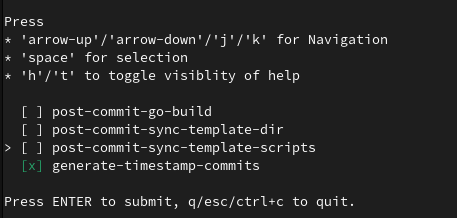
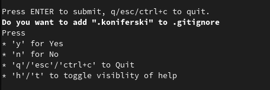

# `dot-user-git-util`

Small CLI util for including maintenance scripts in `.<user>` directory in git repos, where `<user>` is configured with following env variable



## Required env variable configuration

```sh
# Configure this with preferred directory in git repositories
export DOT_USER_GIT_UTIL_TARGET_FOLDER=".$USER"
# Source directory from which to copy scripts
export DOT_USER_GIT_UTIL_TEMPLATE_DIRECTORY=/path/to/template/directory
```

You can find the summary of configuration options in the source code - [here](./config.go)

## Motivation

Motivation for this util is to have a convenient interface for project maintenance through small layer of bash scripts, reused across multiple projects

Assuming all projects are stored in `~/Repositories`

you should be able to find all repositories with following command

```sh
find ~/Repositories -type d -name .git -printf '%h\n'
```

and then easily iterate them with

```sh
for repository in $(find ~/Repositories -type d -name .git -printf '%h\n'); do "$repository/.$USER/my-custom-script.sh"; done
```

or alias this command

```sh
alias take-care-of-stuff='for repository in $(find ~/Repositories -type d -name .git -printf "%h\n"); do echo "$repository/.$USER/my-custom-script.sh"; done'
take-care-of-stuff
```

Note: recommended

### Note about git compatibility

Reusable user-specific things can be included in a custom [template directory](https://git-scm.com/docs/git-init#_template_directory), however I decided to go with another directory for flexibility of whether to include the scripts in VCS

There is also a quick prompt, if you want to `.gitignore` the added scripts



Also, configuring `DOT_USER_GIT_UTIL_TARGET_FOLDER=.git` hasn't been tested (for obvious reasons) and it might/will lead to undesirable side-effects

## Example

1. Clone this repo
2. Run `make build`

    ```sh
    make -C "dot-user-git-util" build
    ```

3. set env variables

    ```sh
    export DOT_USER_GIT_UTIL_TARGET_FOLDER=".$USER"
    export DOT_USER_GIT_UTIL_TEMPLATE_DIRECTORY="$PWD/dot-user-git-util/example-template"
    ```

4. Initialize cloned repo with template, that should be present in `"dot-user-git-util/$USER"`

    ```sh
    ./dot-user-git-util/bin/dot-user-git-util ./dot-user-git-util
    # Note that command takes multiple args
    # Alternatively you could do sth like
    # `find ~/Repositories` -type d -name .git -printf '%h\n' | xargs ./dot-user-git-util/bin/dot-user-git-util
    ```

5. Follow the quick prompt
6. Validate with `find`

    ```sh
    for repository in $(find . -type d -name .git -printf '%h\n'); do "$repository/$DOT_USER_GIT_UTIL_TARGET_FOLDER/hello"; done
    ```

# TODO

- unit tests
